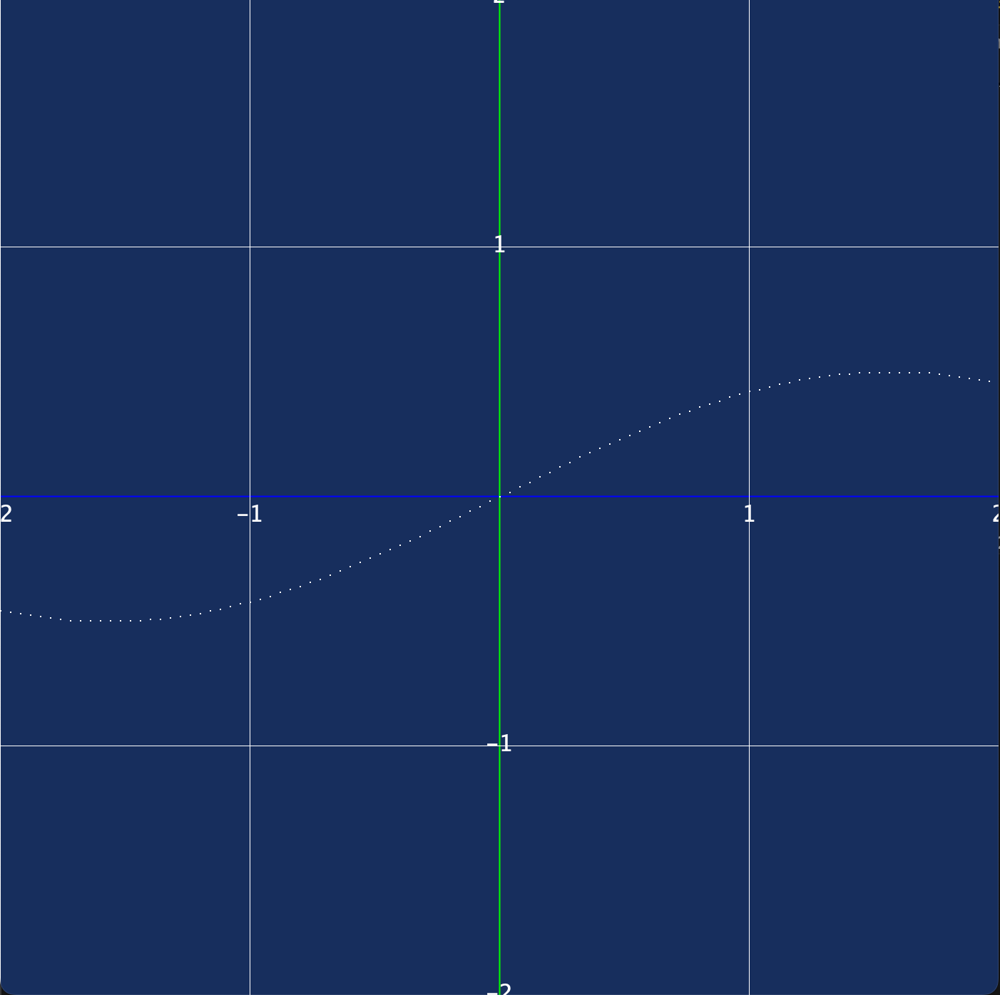

# Space Visualizations
Visualizing functions and spaces in multiple dimensions through coloring techniques, vector fields, user manipulation, and perspective changes. Relies on Java StdDraw drawing for rendering shapes.
Project for working on good software design principles, including the SOLID principles and implementing specific design patterns.

## To run the program:
Set current working directory to spacevisuals
% cd spacevisuals

Ensure you have access permissions
% chmod +x run.sh

Start the program with arguments[i=0], --functionhandle optional
% ./run.sh <animation[i]> <functionhandle> <animation[i+1]> <functionhandle>

### Help:

animation1 'fx' 'fy' 'fz' , animation2 'fx' 'fy' 'fz'

animation options found in enums/AnimationsEnum.java
    type in an enum key after ./run.sh to display that animation
animation input parameters should be based on the same space, meaning either all 2D spaces or all 3D spaces.
animations having a multidimensional output space should recieve a function having that many output dimensions, for example, a domain color function should have two output variables.

#### Example
./run.sh graph2d 'sin(x)/2'

